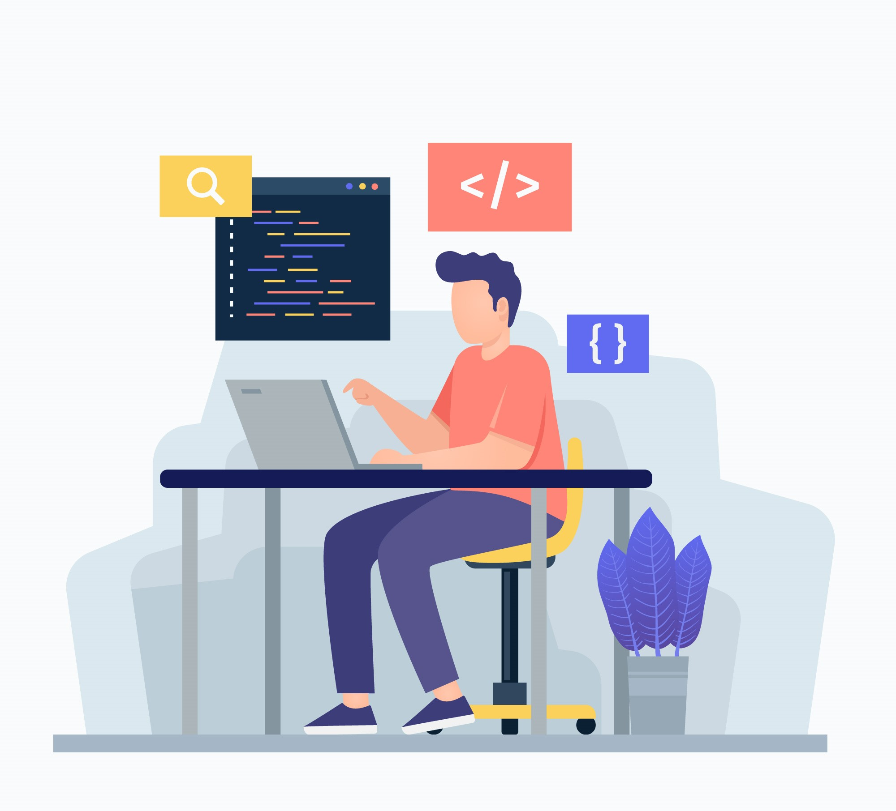

# Addhyan's — Modern Software Solutions Website

An elegant, responsive landing site showcasing services, team, and testimonials. Built with Next.js 13, Tailwind CSS, and React, designed for performance and a clean developer experience.

— Created by **addhyan**

## ✨ Features
- **Responsive UI**: Mobile-first design with Tailwind CSS
- **Fast by default**: Next.js 13 App Router and optimized assets
- **Reusable components**: Modular structure for easy edits and growth
- **Animated stats**: Smooth counters for key metrics
- **Team, Services, and Testimonials** sections ready to customize

## 🧱 Tech Stack
- **Framework**: Next.js 13
- **Language**: React (JS)
- **Styling**: Tailwind CSS
- **Icons**: react-icons
- **Animation**: react-countup

## 📸 Screenshots
> Images are stored in `public/`.




## 🚀 Getting Started

Prerequisites:
- Node.js >= 16 (recommend 18+)
- npm or yarn or pnpm

Install dependencies and start the dev server:

```bash
npm install
npm run dev
# open http://localhost:3000
```

Production build:

```bash
npm run build
npm start
```

## 📂 Project Structure (high level)

```
app/            # Next.js app router pages/layouts
components/     # Reusable UI components
public/         # Static assets (images, icons)
tailwind.config.js
next.config.js
```

## 🔧 Useful Scripts
- `npm run dev` — start dev server
- `npm run build` — production build
- `npm start` — start production server

## 🧭 Customization Tips
- Update global styles in `app/globals.css`
- Edit text and content in components under `components/`
- Replace images in `public/`
- Site title/metadata: `app/layout.js`

## 📬 Author
- **Created by: addhyan**
- GitHub: [github.com/addhyan2000](https://github.com/addhyan2000)
- Email: [greatestaddy@gmail.com](mailto:greatestaddy@gmail.com)


This is a [Next.js](https://nextjs.org/) project bootstrapped with [`create-next-app`](https://github.com/vercel/next.js/tree/canary/packages/create-next-app).

## Getting Started

First, run the development server:

```bash
npm run dev
# or
yarn dev
# or
pnpm dev
```

Open [http://localhost:3000](http://localhost:3000) with your browser to see the result.

You can start editing the page by modifying `app/page.js`. The page auto-updates as you edit the file.

This project uses [`next/font`](https://nextjs.org/docs/basic-features/font-optimization) to automatically optimize and load Inter, a custom Google Font.

## Learn More

To learn more about Next.js, take a look at the following resources:

- [Next.js Documentation](https://nextjs.org/docs) - learn about Next.js features and API.
- [Learn Next.js](https://nextjs.org/learn) - an interactive Next.js tutorial.

You can check out [my GitHub profile](https://github.com/addhyan2000).

## Deploy on Vercel

The easiest way to deploy your Next.js app is to use the [Vercel Platform](https://vercel.com/new?utm_medium=default-template&filter=next.js&utm_source=create-next-app&utm_campaign=create-next-app-readme) from the creators of Next.js.

Check out our [Next.js deployment documentation](https://nextjs.org/docs/deployment) for more details.
